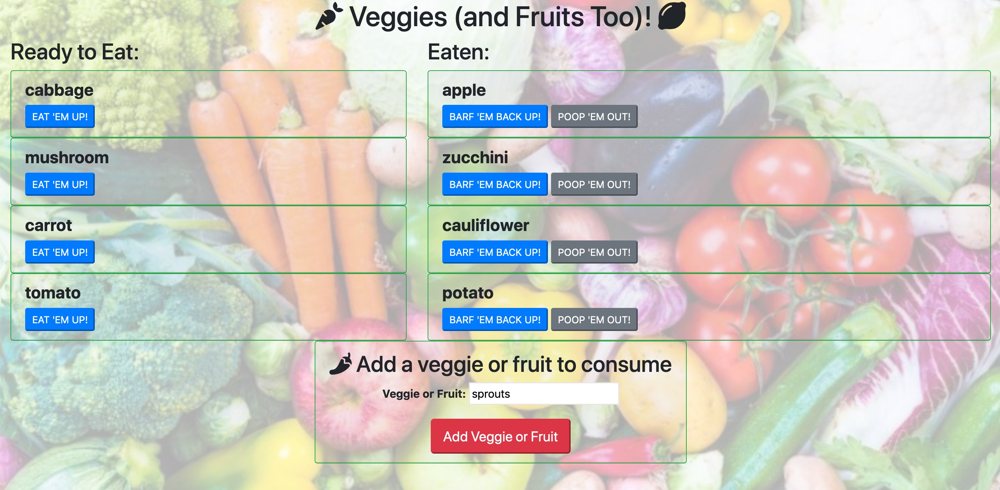

# Veggie and Fruit Logger

### Overview of the Assignment

This assignment is a **veggie and fruit logger** with MySQL, Node, Express, Handlebars and a homemade ORM. The app follows the MVC design pattern, and is adapted from an in-class demo app. Node and MySQL are used to query and route data in the app, and Handlebars to generate the HTML.

## Description

This is a restaurant app the lets you enter names of fruits and veggies (there's no real restriction on what kind of data is entered, but this is the intent). Once entered, the name of the veggie is shown in the left column. In the **Add veggie or fruit to consume** box at the bottom of the page, you can:

* enter the name of a veggie or fruit, and click the *Add Veggie or Fruit* button

From the **Ready to Eat** column on the left side, you can:

* click the *EAT 'EM UP* button to move them into the right **Eaten** column

From the **Eaten** column, you can:

* click the *BARF 'EM BACK UP* button to move them back into the **Ready to Eat** column

* click the *POOP 'EM OUT* button to delete them

## This application uses:

* [Nodejs](https://nodejs.org/en/) Javascript engine.

* [Expressjs](https://expressjs.com/) Web framework for Nodejs.

* [MySQL](https://www.npmjs.com/package/mysql) NPM package to connect to the MySQL database and perform queries.

* [dotenv](https://www.npmjs.com/package/dotenv) zero-dependency NPM package that loads environment variables.

* [orm](https://www.npmjs.com/package/orm) NPM package for object relational mapping.

* [favicon](https://www.npmjs.com/package/favicon) NPM package that allows display of an icon in the browser tab.
